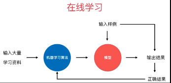
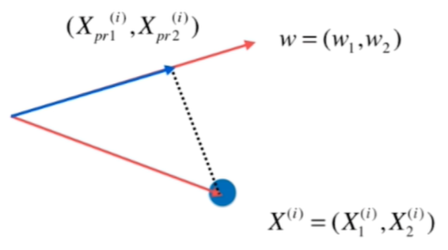
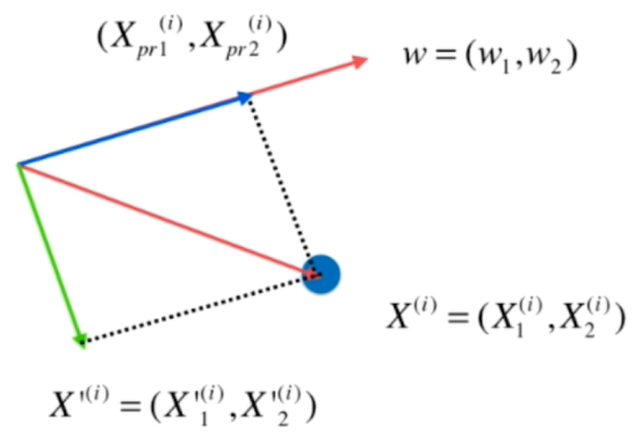
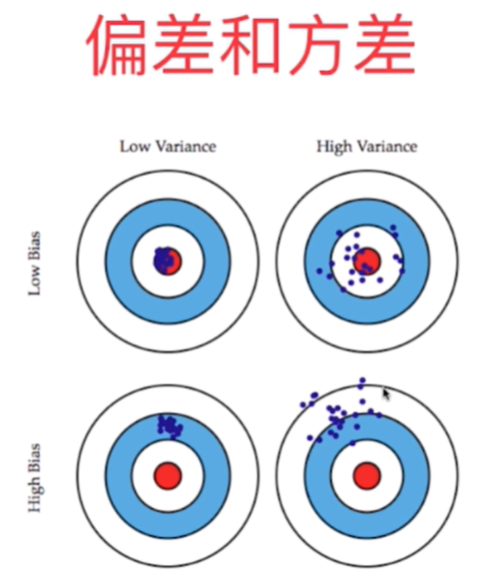
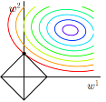
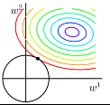
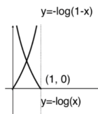
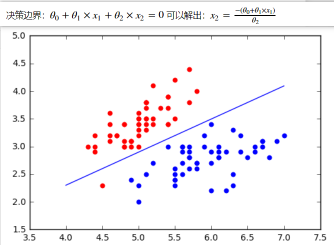
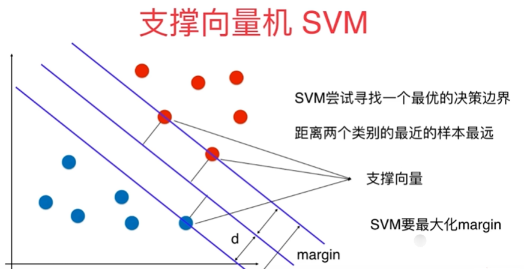
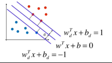

[TOC]

## 机器学习初识

#### 机器学习解决的任务

1. 分类 （二分类、多分类）
2. 回归任务 （预测连续的值）

#### 机器学习方法的分类

---

1. 监督学习 ： 有label
2. 非监督学习：没有label
   * 聚类算法、对数据降维处理 PCA （ 一些高维的数据可以通过降维之后进行可视化）、异常点检测 等应用
3. 半监督学习：一部分有label，一部分没有label
   * 通常都显示用无监督手段对数据做处理，之后使用监督学习的手段做模型的训练和预测 ？？？
4. 增强学习：根据周围环境的情况，采取行动，根据采取行动的结果，学习行动方式

---

1. 批量/离线学习 Batch/Offline Learning

   * 不能适应环境的变化，一次性训练好之后就一直用，即使有了新的数据也不会更改已经训练好的模型。

2. 在线学习 Online Learning

   

   ---

   1. parametric learning
      * 特点：假设可以最大程度地简化学习过程，与此同时也限制可以学习到是什么，这种算法简化成一个已知的函数形式，即通过固定数目的参数来拟合数据的算法。
   2. non-parametric learning
      * 不对目标函数的形式作出强烈假设的算法称为非参数机器学习算法，通过不做假设，它们可以从训练数据中自由地学习任何函数形式，即参数数量会随着训练样本数量的增长的算法。

   ---

#### 机器学习中的参数

* 超参数：训练之前就需要指定的参数，例如　kNN　算法中的 k
* 模型参数：算法过程中学习到的参数

## k邻近算法

   #### 本质：

两个样本如果它们足够的相似的话就有更高的概率属于同一个类别。同时是看距离最近的K个样本，通过投票来判断是属于哪一个类别。

#### 超参数

1. n_neighbors 即 k 值，选者的最近的前 k 个

2. weight：

   * uniform：距离。不考虑距离权重，默认值 
   * distance：距离的倒数，也就是说相当于加了一个距离的权重。考虑距离权重 

3. p：当 weight == distance
     > 明可夫斯基距离: $(\sum_{i = 1}^n|x_i - y_i|^p)^{\frac{1}{p}}$
     >
     > p = 1：曼哈顿距离
     >
     > p = 2：欧拉距离

#### 缺点

* 效率低下，新加入一个节点的时间复杂度为：O(m * n)  m个样本、n个特征。即使可以用使用树结构进行优化：KD-Tree、Ball-Tree
* 高度数据相关：非常受训练数据的影响
* 不具有可解释性
* 维数灾难：随着维度的增加，“看似相近”的两个点之间的距离越来越大。

### 数据归一化

一般是特征之间尺度不同的时候往往会用数据归一化。

* 最值归一化(normalization)：把所有数据映射到 0-1 之间。
  1. 适用于分布有明显边界的情况（例如学生成绩 0-100 、像素点 0-255 等均为有明显的边界）。
  2. 受 outlier (离群值(*outlier*)，也称逸出值，是指在数据中有一个或几个数值与其他数值相比差异较大) 的影响较大。
  3. 计算：$x_{scale} = \frac{x - x_{min}}{x_{max} - x_{min}}$
* 均值方差归一化(stardardization)：把所有数据归一到均值为 0 方差为 1 的分布中。  一般用这个。
  1. 适用于数据分布没有明显边界的情况；有可能存在极端值
  2. 计算：$x_{scale} = \frac{x - x_{mean}}{s}$ s:方差

## 线性回归

* 解决回归问题  
* 思想简单，实现容易  
* 许多强大的非线性模型的基础  
* 结果具有很好的可解释性  
* 蕴含机器学习中的很多重要思想 

### 简单线性回归

对于m个特征数目为 1 的样本，其损失值定义如下：
$$
\begin{align}
Loss &= \sum_{ i =1 }^m(y^{(i)} - \hat{y}^{(i)})^2 \\
\hat{y}^{(i)} &= a\times x^{(i)} + b
\end{align}
$$
对a与b分别求偏导，可得：
$$
a =
$$

### 线性回归算法的评测

* 均方误差：MSE(Mean Squared Error)
$$
\frac{1}{m}\sum_{i = 1}^m(y_{test}^{(i)} - \hat{y}_{test}^{(i)})^2
$$

* 均方根误差：RMSE(Root Mean Squared Error)  可以调节量纲，是的误差的量纲与y的量纲一样的。量纲一样的话更容易反映出模型的好坏，因为可以直接与y相比，看误差大小，可以单独的看模型的表现。如果量纲不一样，可以与不同模型之间比较来反映模型的好坏，不对比就很难看出来自己的	好坏。

$$
\sqrt{\frac{1}{m}\sum_{i = 1}^m(y_{test}^{(i)} - \hat{y}_{test}^{(i)})^2}
$$

* 平均绝对误差：MAE(Mean Absolute Error)
  $$
  \frac{1}{m}\sum_{i = 1}^m|y_{test}^{(i)} - \hat{y}_{test}^{(i)}|
  $$
  
  一般不用加绝对值的作为损失函数，因为往往不是处处可导，求极值会麻烦。但是可以用于评价。也就是说损失函数与评价函数不一样要一样。

  MAE与RMSE量纲一样，与 y 的量纲相同。

* R Squared ：

    $$
    R^2  = 1 - \frac{\sum_i(\hat{y}^{(i)} - y^{(i)})^2}{\sum_i(\bar{y}^{(i)} - y^{(i)})^2}
    $$

    分子上：使用我们的模型预测产生的错误
    分母上：使用 $y=\bar{y}$ 预测产生的错误。 其实这里相当于一个 base model ，什么值都预测为均值，这个预测模型可以说是很差的了。

    1. $R^2 \le 1$ 
    2. $R^2$ 越大越好。 当我们的预测模型不犯任何错误时，$R^2$ 得到最大值 1
    3. 当我们的模型等于基准模型($y = \bar{y}$)的时，$R^2$ 为0。
    4. 如果 $R^2 < 0$ ，说明我们学习到的模型的误差是比基准模型的误差还大，换句话说还不如基准模型的预测效果好。此时，我们的数据很可能不存在任何的线性关系。 

    $$
    R^2  = 1 - \frac{\sum_i(\hat{y}^{(i)} - y^{(i)})^2}{\sum_i(\bar{y}^{(i)} - y^{(i)})^2}  = 
    1 - \frac{\sum_i(\hat{y}^{(i)} - y^{(i)})^2 / m}{\sum_i(\bar{y}^{(i)} - y^{(i)})^2 / m} = 
    1 - \frac{MSE(\hat{y}, y)}{Var(y)}
    $$

    $Var(y)$ 是方差。

## 梯度下降法

​	既然在变量空间的某一点处，函数沿梯度方向具有最大的变化率，那么在优化目标函数的时候，自然是沿着负梯度方向去减小函数值，以此达到我们的优化目标。 	同时梯度和偏导数都是向量，那么参考向量运算法则，我们在每个变量轴上减小对应变量值即可，梯度下降法可以描述如下：
								$$ gradf(x_0, x_1, ... , x_n) = (\frac{\partial f}{\partial x_0}, ... , \frac{\partial f}{\partial x_n}) $$
	同时梯度和偏导数都是向量，那么参考向量运算法则，我们在每个变量轴上减小对应变量值即可，梯度下降法可以描述如下：
									$ x_0 := x_0 - \alpha\frac{\partial f}{\partial x_0} \\ ... \ ... \\ x_n := x_n - \alpha\frac{\partial f}{\partial x_n} $

​	该点方向导数最大值和该点梯度向量的模相等。
通俗理解：
	把这一点带入到梯度函数中,结果为正,那我们就把这一点的值变小一些,同时就是让梯度变小些;当这一点带入梯度函数中的结果为负的时候,就给这一点的值增大一些。整体来说就是让梯度趋近于0，从而逼近极值点。

注意：

* 这里的 $\alpha$ 为学习率，学习率过高可能会导致模型不收敛，过小训练速度太慢，一般设置为 0.01 / 0.001 是问题不大的。
* 只进行一次的梯度下降法，有可能陷入局部最优解。解决办法：多次运行，随机化初始点，来缓解矛盾。

### 多元线性回归的正规方程解(Normal  Equation)

$$
\Theta = (X_b^TX_b)^{-1}X_b^{T}y   \ \ \ 注：时间复杂度：O(n^3)
$$

### 在多元线性回归中使用梯度下降法

对于m个特征数目为 n 的样本，其损失函数定义如下：
$$
\begin{align}
L &= \sum_{ i =1 }^m(y^{(i)} - \hat{y}^{(i)})^2 \\
\hat{y}^{(i)} &= \theta_0 + \theta_1 x_1^{(i)} + \theta_2 x_2^{(i)} + \ \dots \ + \theta_n x_n^{(i)} \\
\hat{y}^{(i)} &= X_b^{(i)} \Theta  \ \ 注：\Theta 为列向量\\
X_b &= [\vec{x_0}, \vec{x_1}, \vec{x_2}, \dots, \vec{x_n}] \  \ \ 注：  \vec{x_0}是新增加的一个全 1 的列向量
\end{align}
$$

对每个参数进行求偏导，以求出其梯度：
$$
\nabla{L(\Theta)} =  \left(
\begin{array}{ccc}
\frac{\partial{L}}{\partial{\theta_0} }\\
\frac{\partial{L}}{\partial{\theta_1} }\\
\vdots\\
\frac{\partial{L}}{\partial{\theta_n} }\\
\end{array}
\right) = 
\left(
\begin{array}{ccc}
2 \times \sum_{i=1}^{m}(y^{(i)} - X_b^{(i)}\Theta) \times -1 \\
2 \times \sum_{i=1}^{m}(y^{(i)} - X_b^{(i)}\Theta) \times -X_1^{(i)} \\
\vdots\\
2 \times \sum_{i=1}^{m}(y^{(i)} - X_b^{(i)}\Theta) \times -X_n^{(i)} \\
\end{array}
\right)= 
2\left(
\begin{array}{ccc}
 \sum_{i=1}^{m}(X_b^{(i)} \Theta - y^{(i)}) \times 1 \\
\sum_{i=1}^{m}(X_b^{(i)} \Theta - y^{(i)})  \times X_1^{(i)} \\
\vdots\\
\sum_{i=1}^{m}(X_b^{(i)} \Theta - y^{(i)})  \times X_n^{(i)} \\
\end{array}
\right)
$$

这样会发现梯度受到样本个数的影响，所以调整下损失函数，将损失函数除以 m ，那就可以把这个关系去除掉。$L = \frac{1}{m}\sum_{ i =1 }^m(y^{(i)} - \hat{y}^{(i)})^2$ ，有些教材会写成 $L = \frac{1}{2m}\sum_{ i =1 }^m(y^{(i)} - \hat{y}^{(i)})^2$ 其实就是再把求导下来的2给去掉，影响不大。 整理之后可以简写为：$\frac{2}{m}X_b^T(X_b\Theta - y)$

### 随机梯度下降法

* 不是一个机器学习算法
* 是一种基于搜索的最优化方法  
* 作用：最小化一个损失函数  
* 梯度上升法：最大化一个效用函数 ，即按照梯度的正方向走。

随机选者一个样本计算梯度，根据该梯度的方向走，为了防止最后的逼近最优解的时候由于步子太大而到不了最后的最优解，那么就可以动态的调节学习率 $\eta = \frac{t0}{iter\_time + t1}$ ,$iter\_time$ 是迭代次，从0开始。根据经验值，$t0 = 5,t1=50$ 。

###  关于梯度的调试

~~~python
def dL_debug(theta, X_b, y, epsilon = 0.01): # 测试计算是否正确，用该函数可以进行比较。 
    res = np.empty(len(theta))
    for i in range(len(theta)):
        theta1 = theta.copy()
        theta1[i] += epsilon
        theta2 = theta.copy()
        theta2[i] -= epsilon
        res[i] = (L(theta1, X_b, y) - L(theta2, X_b, y)) / (2 * epsilon)
    return res
~~~

### 机器学习中的随机

* 跳出局部最优解
* 更快的运行速度
* 机器学习领域很多算法都要使用随机的特点：随机搜索、随机深林

## 主成分分析法

找到一个轴（一个向量），使样本映射到该轴之后的方差最大，那么该轴所占所有样本的成分最大，第一次找到的最大的就是第一成分，最大的成分。

* 一个非监督的机器学习算法  

* 主要用于数据的降维  

* 通过降维，可以发现更便于人类理解的特征  

* 其他应用：可视化；去噪

找到让样本间距最大的轴，使用方差作为评判标准，$Var(x) = \frac{1}{m} \sum_{i =1 }^m(x_i - \bar{x}) ^ 2$ 。换句话说寻找一个一维基，使得所有数据变换为这个基上的坐标表示后，方差值最大。

1. 将样本的均值归为 0 （demean）

2. 因为 $\bar{x} =0$ ，$Var(x) = \frac{1}{m} \sum_{i =1 }^mx_i^ 2$

3. 我们想要求一个轴的方向，w = (w1, w2，...，wn)，是我们的样本映射到 w 以后，有： $Var(X_{projext}) = \frac{1}{m} \sum_{i = 1}^m||X_{project}^{(i)} - \bar{X}_{project}||^2​$最大。${X}_{project}​$ 为映射到w轴之后的向量，如图所示。

4. 由于做了demean，所以$\bar{X}_{project} = 0$ ，所以就是求$Var(X_{projext}) = \frac{1}{m} \sum_{i = 1}^m||X_{project}^{(i)}||^2$ 

5. $$
   \begin{align}
   X^{(i)}·w &= ||X^{(i)}||·||w||·cos{\theta} \\
   X^{(i)}·w &= ||X^{(i)}||·cos{\theta} \\
   X^{(i)}·w &= ||X_{project}^{(i)}||
   \end{align}
   $$

   $(i)$ 为第 $i$ 个样本的意思。所 以问题转化为了求 $Var(X_{projext}) = \frac{1}{m} \sum_{i = 1}^m(X^{(i)}w)^2$ 得最大值，我们在这里使用梯度上升法求解。

6. 首先求梯度，就是对每个$w_i$求偏导：

  
   $$
   \nabla{f} = \left(
   \begin{array}{ccc}
   \frac{\partial{f}}{\partial{w_1} }\\
   \frac{\partial{f}}{\partial{w_2} }\\
   \vdots\\
   \frac{\partial{f}}{\partial{w_n} }\\
   \end{array}
   \right) = \frac{2}{m}
   \left(
   \begin{array}{ccc}
    \sum_{i=1}^{m}(X^{(i)}w) \times X_1^{(i)} \\
    \sum_{i=1}^{m}(X^{(i)}w)  \times  X_2^{(i)} \\
   \vdots\\
    \sum_{i=1}^{m}(X^{(i)}w) \times  X_n^{(i)} \\
   \end{array}
   \right) = 
   \frac{2}{m}X^T(Xw)
   $$

7. 然后就用梯度上升法就可以求解第一主成分了。

那第二、第三、... 等主成分如何求解？

通过对数据进行改变，将数据在第一个主成分上的分量去掉。
$$
\begin{align}
X^{(i)}·w &= ||X_{project}^{(i)}|| \\
X_{project}^{(i)} &= ||X_{project}^{(i)}|| · w \ \ \  \# 标量上加一个方向，成了向量\\
X_{project}^{(i)} &= X^{(i)}·w· w \\
X^{`(i)} &= X^{(i)} - X_{project}^{(i)}   \ \ \ \# 向量减法
\end{align}
$$

根据减去前一个主成分的分量之后的数据作为新的数据集，然后再求第一主成分，就和之前的步骤一样了。循环往复。

主成分分析还可以用于降噪，就是把不重要的那几个分量去掉，去掉的很可能就是噪音

## 多项式回归

这个有点类似升高维度，如果一个散点图的趋势是2次函数，那么对于训练数据集就可以增加一列数据，增加$x^2$ 然后用线性回归的方法就可以实现多项式回归，这样可以更好的去拟合一些非线性的数据，而绝大数情况下，都是非线性的数据。（总结：对线性回归之前添加新的一些列。
可以自己手动添加列，也可用sklearn里的PloynomialFeatures(degree = n) n次的。

### 过拟合（overfitting）或欠拟合（underfitting）

过拟合：泛化能力很差，也就是在训练集表现很好，而测试集表现很差
欠拟合：模型简单，在训练集上的准确率不高，同时在测试集上的准确率也不高

### 学习曲线

一种用来判断训练模型的一种方法，通过观察绘制出来的学习曲线图，我们可以比较直观的了解到我们的模型处于一个什么样的状态，如：过拟合（overfitting）或欠拟合（underfitting）。看学习曲线的走向，随着样本的增大如果训练集和测试集曲线越接近那么一般效果越好，否者就是发生了过拟或欠拟合

### 验证数据集

如果只将数据集分成测试数据集和训练数据集，那么在训练模型的过程中，我们会根据测试集中表现得好坏来调节模型得参数，但是可能会造成在测试集上得一个过拟合。

所以我们要把数据集分成：

* 训练数据集：训练模型
* 验证数据集：调节参数
* 测试数据集：作为最终衡量模型性能得数据集，不参与模型得整个训练过程得任何一个步骤。

### K折交叉验证(K-fold Cross Validation)

将训练数据集分成K组（一般是均分），将每个子集数据分别做一次验证集，其余的K-1组子集数据作为训练集，这样会得到K个模型，用这K个模型最终的验证集的分类准确率的平均数作为性能指标。CV可以有效的避免过拟合与欠拟合的发生，最后得到的结果也比较具有说服性。

~~~python
score_arr = cross_val_score(model, X_train, y_train, cv = k) # 默认是分3份
~~~

### LOOCV - Leave-One-Out-Cross-Validation 留一交叉验证

 正常训练都会划分训练集和验证集，训练集用来训练模型，而验证集用来评估模型的泛化能力。留一交叉验证是一个极端的例子，如果数据集D的大小为N,那么用N-1条数据进行训练，用剩下的一条数据作为验证，所以在留一交叉验证里，每次从D中取一组作为验证集，直到所有样本都作过验证集，共计算N次，最后对验证误差求平均，这种方法称之为留一法交叉验证。

优点：充分利用数据
缺点：训练起来耗时

## 偏差与方差权衡(Bias Variance Trade off)

模型的误差 = 偏差 + 方差 + 不可避免地误差(比如数据本身就是有噪音的)

偏差：对数据本身的假设不正确（如：非线性数据使用线性回归）；欠拟合
方差：数据地一点点扰动都会较大地影响模型。往往是因为使用地模型太过复杂，学习到了一些不重要地东西（如：高阶多项式回归）；过拟合

* 有一些算法天生是高方差的算法，如kNN、决策树。非参数学习通常都是高方差算法。因为不对数据进行任何假设  。
* 有一些算法天生是高偏差算法。如线性回归。参数学习通常都是高偏差算法。因为对数据具有极强的假设 。

机器学习的主要挑战，来自于方差，解決高方羞的通常手段：

1. 降低模型复杂度  

2. 减少数据维度；降噪  

3. 增加样本数  

4. 使用验证集

5. 模型的正则化

### 模型正则化

在线性回归损失函数中加入模型正则化：

岭回归：
$$
J(\Theta)  = \frac{1}{m}\sum_{ i =1 }^m(y^{(i)} - \theta_0 - \theta_1X_1^{(i) }- \ldots - \theta_nX_n^{(i)})^2 + \alpha\frac{1}{2}\sum_{i=1}^n{\Theta_i^2}
$$
就是说我不让 MSE 尽可能小，我也让系数的平方和尽可能小，这么一来就会防止系数过大导致模型陡峭不平滑。注意：1. 不用加$\theta_0$ 因为 $\theta_0$ 只决定了模型整体的上下位置，而不决定模型的趋势。2. $\frac{1}{2}$ 是为了方便求导的，加不加都行。  

LASSO回归：
$$
J(\Theta)  = \frac{1}{m}\sum_{ i =1 }^m(y^{(i)} - \theta_0 - \theta_1X_1^{(i) }- \ldots - \theta_nX_n^{(i)})^2 + \alpha\sum_{i=1}^n{|\Theta_i|}
$$
Lp范数：
$$
||x||_p = (\sum_{i = 1}^n|x_i|^p)^{\frac{1}{p}}
$$

* LASSO：$\sum_{i =1 }^n|\theta_i|​$  L1正则项
  L1正则化可以产生稀疏模型。抽象理解：因为L1正则项，往往是一个带着棱角的图形，当靠近时往往是先碰到棱角，换句话说就是棱角往往是最优解存在的地方。而棱角的地方往往要么是0要么是1(极端些看)。通过一个图形来展示就是：
  

图中等值线是J0的等值线，黑色方形是L函数的图形。L=∣w1∣+∣w2∣，这个函数画出来就是一个方框。
在图中，当J0等值线与L图形首次相交的地方就是最优解。上图中J0与L在L的一个顶点处相交，这个顶点就是最优解。注意到这个顶点的值是(w1,w2)=(0,w)。可以直观想象，因为L函数有很多『突出的角』（二维情况下四个，多维情况下更多），J0与这些角接触的机率会远大于与L其它部位接触的机率（这是很直觉的想象，突出的角比直线的边离等值线更近写），而在这些角上，会有很多权值等于0（因为角就在坐标轴上），这就是为什么L1正则化可以产生稀疏模型，进而可以用于特征选择。

* Ridge : $\sum_{i = 1}^n\theta^2$ L2正则项
  L2正则化可以防止过拟合
  

二维平面下L2正则化的函数图形是个圆（绝对值的平方和，是个圆），与方形相比，被磨去了棱角。因此J0与L相交时使得w1或w2等于零的机率小了许多（这个也是一个很直观的想象），这就是为什么L2正则化不具有稀疏性的原因，因为不太可能出现多数w都为0的情况。

弹性网 ELastic Net
$$
J(\Theta)  = \frac{1}{m}\sum_{ i =1 }^m(y^{(i)} - \theta_0 - \theta_1X_1^{(i) }- \ldots - \theta_nX_n^{(i)})^2 + r\alpha\sum_{i=1}^n{|\Theta_i|} + \frac{1 - r}{2}\alpha\sum_{i=1}^n\theta_i^2
$$
综合了L1与L2的优点。

## 逻辑回归

逻辑回归（Logistic Regression）是一种用于解决二分类（0 or 1）问题的机器学习方法。

逻辑回归的损失函数：

首先逻辑回归是返回0-1之间的一个数，含义是概率，一般设置阈值为0.5，大于0.5则认为是1.小于0.5则认为是0。
$$
\hat{p} = \sigma(\theta^T·x_b) = \frac{1}{1 + e^{-\theta^T·x_b}}
$$
接下来看如何找到损失函数：
$$
f(x)=\left\{
\begin{aligned}
1 &,  \hat{p} \ge 0.5 \\
0 &,  \hat{p} \le 0.5 \\
\end{aligned}
\right. \\
cost=\left\{
\begin{aligned}
如果y=1，p越小，cost越大 \\
如果y=0，p越大，cost越大\\
\end{aligned}
\right. \\
$$
因此cost代价函数###可以用如下来表示：
$$
f(x)=\left\{
\begin{aligned}
-log(\hat{p}) \ \ \ \ \    if\ \ \  y=1 \\
-log(1 - \hat{p}) \ \ \ \  \ if \ \ \ y=0\\
\end{aligned}
\right.
$$

该图像可以明显看出来分别对预测值预测1或者0预测错的的代价。将这两代价合成一个可以这么表达：
$$
cost = -ylog(\hat{p}) - (1- y)log(1- \hat{p})
$$
所以总的样本的损失函数可以有如下的定义:
$$
J(\Theta) = -\frac{1}{m}\sum_{i = 1}^{m} y^{(i)}log(\hat{p}^{(i)}) + (1- y^{(i)})log(1- \hat{p}^{(i)})
$$

$$
\hat{p}^{(i)} = \sigma(X_b^{(i)}\theta) = \frac{1}{1 + e^{-X_b^{(i)}\theta}}
$$

总：
$$
J(\Theta) = -\frac{1}{m}\sum_{i = 1}^{m} y^{(i)}log(\sigma(X_b^{(i)}\theta) ) + (1- y^{(i)})log(1- \sigma(X_b^{(i)}\theta) )
$$
没有公式解，只能使用梯度下降法。该函数是一个凸函数没有局部最优解，所以只有一个全局最优解，故用梯度下降法完全可以找到全局最优解。不用实验多次梯度下降。

梯度：
$$
\begin{align}
\frac{J(\theta)}{\theta_j} &= \frac{1}{m}\sum_{i =1}^m(\sigma(X_b^{(i)}\theta) - y^{(i)})X_j^{(i)} \\
&=  \frac{1}{m}\sum_{i =1}^m(\hat{y}^{(i)} - y^{(i)})X_j^{(i)} 
\end{align}
$$

$$
\nabla{J(\theta)} = \frac{1}{m} · X_b^T · (\sigma(X_b\theta) - y)
$$

### 决策边界

$$
\hat{p}^{(i)} = \sigma(X_b^{(i)}\theta) = \frac{1}{1 + e^{-X_b^{(i)}\theta}}\\
\hat{y}=\left\{
\begin{aligned}
1 &,  \hat{p} \ge 0.5 \ \ \ \ \   X_b\theta \ge 0\\
0 &,  \hat{p} \le 0.5 \ \ \ \ \ X_b\theta \lt 0\\
\end{aligned}
\right. \\
决策边界：X_b \theta
$$

### 添加多项式

思想和多项式线性回归差不多

### OVR（One vs Rest）and OVO（One vs One）

* OVR：n 种类型的样本进行分类时，分别取一种样本作为一类，将剩余的所有类型的样本看做另一类，这样就形成了 n 个二分类问题，使用逻辑回归算法对 n 个数据集训练出 n 个模型，将待预测的样本传入这 n 个模型中，所得概率最高的那个模型对应的样本类型即认为是该预测样本的类型；
  **时间复杂度**：$O(n)$
* OVO：n 类样本中，每次挑出 2 种类型，两两结合，一共有 $C_{n}^2$ 种二分类情况，使用 $C_{n}^2$ 种模型预测样本类型，有 $C_{n}^2$ 个预测结果，种类最多的那种样本类型，就认为是该样本最终的预测类型；**时间复杂度**：$O(n^2)$

### 混淆矩阵

| 真实值\预测值 | 0（negative） | 1（postive） |
| ------------- | ------------- | ------------ |
| 0             | TN            | FP           |
| 1             | FN            | TP           |

精准率：预测是1，并且对的概率
$$
precision=\frac{TP}{TP + FP}
$$
召回率：真实是1，预测是1的概率
$$
recall = \frac{TP}{TP + FN}
$$
举一些例子，拿预测癌症患者为例子，同时注意往往把关注的时间设为1，因为设患癌症用1表示，反之。

精准率：预测多少任患癌症，真正预测对的概率。比如预测5个任患有癌症，实际只有1个患的，精准率：1/5。
召回率：所有的癌症患者能被预测出来的概率。比如有5个癌症患者预测对了4个，召回率：4/5。

精准率和召回率可以更好的反应数据不均衡的时候的真实预测得分。具体使用哪一种得分需要根据具体的应用场景来决定，比如股票预测一般用精准率，而癌症预测要用召回率评价。

### F1 Score

F1 Score 是precision与recall的调和平均值。兼顾两者，调和平均值特点：只有两者都比较高的时候F1才会比较高。有一方是低分的时候总体就会很低。
$$
\frac{1}{F1} = \frac{1}{2}(\frac{1}{precisioin} + \frac{1}{recall})
$$

### ROC 曲线

$$
\begin{align}
FPR &= \frac{FP}{FP + TN} \\
TPR &= \frac{TP}{TP+FN}
\end{align}
$$

ROC曲线是以FPR为x轴，TPR为y轴。AUC为ROC曲线下面积，不受数据集不平衡的影响，更加客观的反应模型的好坏。

## SVM

### Hard SVM

svm本质

margin = 2d，接下来找最小的d。
首先看一个简单的点到直线的距离,（x, y）到直线$Ax + By + C = 0$，后来可以再进行扩展使用：
$$
d = \frac{|Ax+By+C|}{\sqrt{A^2 + B^2}}
$$
现在将其扩展到n维空间：直线：$w^Tx + b = 0$ ，点 $\vec{x}$ 到直线的距离：
$$
\begin{align}
d &= \frac{|w^Tx + b|}{||x||} \\
||x|| &= \sqrt{w_1^2 + w_2^2 + \ldots + w_n^2}
\end{align}
$$
然后根据支撑向量机的本质可以推出以下公式，这里1代表正样本，-1代表负样本
$$
\begin{align}
 \frac{w^Tx^{(i)} + b}{||x||}  &\ge d \ \ \ if \ \ \ y^{(i)}=1\\
\frac{w^Tx^{(i)} + b}{||x||} &\le d   \ \ \ if \ \ \ y^{(i)}=-1  \\
\end{align}
$$
d可以除过去：
$$
\begin{align}
 \frac{w^Tx^{(i)} + b}{||x||d}  &\ge 1 \ \ \ if \ \ \ y^{(i)}=1\\
\frac{w^Tx^{(i)} + b}{||x||d} &\le 1   \ \ \ if \ \ \ y^{(i)}=-1  \\
\end{align}
$$
然后把 $\frac{1}{||x||d}$ 看作常数然后并入 $w$ 成为 $w_d$ ，并入 $b$ 成为 $b_d$ :
$$
\begin{align}
 {w_d^Tx^{(i)} + b_d}  &\ge 1 \ \ \ if \ \ \ y^{(i)}=1\\
 {w_d^Tx^{(i)} + b_d} &\le 1   \ \ \ if \ \ \ y^{(i)}=-1  \\
\end{align}
$$

把 $w^Tx + b = 0$ 等式两边同时除以 $\frac{1}{||x||d}$ 可以改写成 $w_d^Tx + b_d = 0$
$$
\begin{align}
 {w_d^Tx^{(i)} + b_d}  &\ge 1 \ \ \ if \ \ \ y^{(i)}=1\\
 {w_d^Tx^{(i)} + b_d} &\le 1   \ \ \ if \ \ \ y^{(i)}=-1  \\
\end{align}\\
可以用一个式子表示：y^{(i)}( {w_d^Tx^{(i)} + b_d} ) \ge 1
$$
现在推导出来SVM必须要满足：$y^{(i)}( {w_d^Tx^{(i)} + b_d} ) \ge 1$ 这个约束条件的。

对于支撑向量x，我们的目标是最大化margin：$max(\frac{|w^Tx + b|}{||x||}) \vec{} max(\frac{1}{||x||}) \vec{} min({||x||}) \vec{} min{\frac{1}{2}||x||^2}$ 

Finally:
$$
min{\frac{1}{2}||x||^2} \\
s.t. \ \ \ y^{(i)}( {w_d^Tx^{(i)} + b_d} ) \ge 1
$$
这个Hard SVM受离值点的数比较敏感，使用Soft SVM可以解决。

### Soft SVM

加L1正则：
$$
min{\frac{1}{2}||x||^2} + C\sum_{i = 1}^m \zeta_i\\
s.t. \ \ \ y^{(i)}( {w_d^Tx^{(i)} + b_d} ) \ge 1 - \zeta_i  \ \ \ \zeta_i \ge 0
$$
加L2正则：
$$
min{\frac{1}{2}||x||^2} + C\sum_{i = 1}^m \zeta_i^2\\
s.t. \ \ \ y^{(i)}( {w_d^Tx^{(i)} + b_d} ) \ge 1 - \zeta_i  \ \ \ \zeta_i \ge 0
$$

## 决策树

* 非参数学习算法  
* 可以解决分类问题 ，天然可以解决多分类问题  
* 可以解决回归问题  
* 非常好的可解释性 

### 信息熵

熵在信息论中代表随机变量不确定度的度量
$$
H = -\sum_{i = 1}^kp_ilog(p_i)
$$
直观看下：

| 三个事件分别发生的概率                   | 信息熵 |
| ---------------------------------------- | ------ |
| $\frac{1}{3},\frac{1}{3},\frac{1}{3}$    | 1.0986 |
| $\frac{1}{10},\frac{2}{10},\frac{7}{10}$ | 0.8018 |
| $1,0,0$                                  | 0      |

可以看出来发生事件越不确定信息熵就越大。

## K-means算法

无监督学习。

聚类算法有很多种，K-Means 是聚类算法中的最常用的一种，算法最大的特点是简单，好理解，运算速度快，但是只能应用于连续型的数据，并且一定要在聚类前需要手工指定要分成几类。

K-Means 聚类算法的大致意思就是“物以类聚，人以群分”，风趣解释：

1. 首先输入 k 的值，即我们指定希望通过聚类得到 k 个分组。
2. 从数据集中随机选取 k 个数据点作为初始大佬（质心）。
3. 对集合中每一个小弟，计算与每一个大佬的距离，离哪个大佬距离近，就跟定哪个大佬。
4. 这时每一个大佬手下都聚集了一票小弟，这时候召开选举大会，每一群选出新的大佬（即通过算法选出新的质心）。
5. 如果新大佬和老大佬之间的距离小于某一个设置的阈值（表示重新计算的质心的位置变化不大，趋于稳定，或者说收敛），可以认为我们进行的聚类已经达到期望的结果，算法终止。
6. 如果新大佬和老大佬距离变化很大，需要迭代3~5步骤。

## 集成学习

