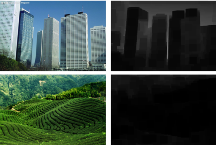
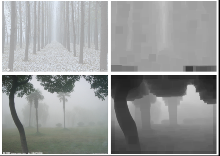
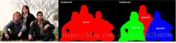

[TOC]

## 低层视觉 

### dehaze（去雾） 

图像去雾技术综述: https://blog.csdn.net/lidb86/article/details/83141344?utm_medium=distribute.pc_relevant.none-task-blog-baidujs-3 

图像去雾算法（一）相关研究及链接:https://blog.csdn.net/piaoxuezhong/article/details/78301999?utm_medium=distribute.pc_relevant_t0.none-task-blog-BlogCommendFromMachineLearnPai2-1.nonecase&depth_1-utm_source=distribute.pc_relevant_t0.none-task-blog-BlogCommendFromMachineLearnPai2-1.nonecase

图像去雾算法的原理、实现、效果:https://blog.csdn.net/m0_37407756/article/details/83070142?utm_medium=distribute.pc_relevant.none-task-blog-baidujs-3

在绝大多数非天空的局部区域里，某一些像素总会有至少一个颜色通道具有很低的值。换言之，该区域光强度的最小值是个很小的数。在这里，我们所说的颜色通道是指RGB三个颜色的通道。而且这个暗通道的数值应该是逼近于零的。所以可以通过暗通道下手。

### denoise（去噪）

计算机视觉5-图像去噪：https://blog.csdn.net/weixin_44738378/article/details/106566541

深度学习图像去噪发展概述：https://blog.csdn.net/edogawachia/article/details/78643190?utm_medium=distribute.pc_relevant.none-task-blog-BlogCommendFromMachineLearnPai2-2.nonecase&depth_1-utm_source=distribute.pc_relevant.none-task-blog-BlogCommendFromMachineLearnPai2-2.nonecase

### derain（去雨）

视频和单图像去雨水方法综述：https://zhuanlan.zhihu.com/p/89481603

图像视频去雨的几种主流方法：https://blog.csdn.net/qq_19924321/article/details/83025392

### deblur（去模糊）

图像去模糊：<https://www.jianshu.com/p/ae5fc2d31f29> 

CVPR 2018：腾讯图像去模糊、自动人像操纵最新研究 ：<https://www.sohu.com/a/233291117_473283> 

图像去模糊（一）理解模糊核：<https://blog.csdn.net/xueruhongchen/article/details/52783119?locationNum=4>  （感觉和卷积核差不多，知识通过模糊核的卷积就模糊了

### low-light enhancement （低光照增强 ）

基于深度学习的低光照图像增强方法总结（2017-2019）：<https://blog.csdn.net/hyk_1996/article/details/99641652?utm_medium=distribute.pc_relevant.none-task-blog-BlogCommendFromMachineLearnPai2-1.nonecase&depth_1-utm_source=distribute.pc_relevant.none-task-blog-BlogCommendFromMachineLearnPai2-1.nonecase> 

低光照图像增强算法汇总:<https://blog.csdn.net/WZZ18191171661/article/details/104325353?utm_medium=distribute.pc_relevant.none-task-blog-BlogCommendFromMachineLearnPai2-2.nonecase&depth_1-utm_source=distribute.pc_relevant.none-task-blog-BlogCommendFromMachineLearnPai2-2.nonecase> 

## 高层视觉

计算机视觉技术与应用综述：https://www.icode9.com/content-4-397084.html

人脸识别技术大总结1——Face Detection & Alignment(https://www.cnblogs.com/sciencefans/p/4394861.html)

###object   detection/identification/recognition  (目标  检测/识别)

物体（目标）检测，包含两个问题：

* 一是判断属于某个特定类的物体是否出现在图中；
* 二是对该物体定位，定位常用表征就是物体的边界框。可实现：输入测试图片，输出检测到的物体类别和位置。

物体识别：https://zhuanlan.zhihu.com/p/36668416

* 计算机视觉领域中的一项基础研究，它的任务是识别出图像中有什么物体，并报告出这个物体在图像表示的场景中的位置和方向。

###face   detection/identification/recognition  (面部  检测/识别)

面部检测(https://firebase.google.cn/docs/ml-kit/face-detection-concepts?authuser=0&hl=tr)，是检测出图像中人脸所在位置的一项技术。<https://www.jianshu.com/p/6ed3e26b4ebc> 

人脸识别简介：<https://www.jianshu.com/p/6ed3e26b4ebc> 

### instance/semantic segmentation (实例/语义分割)

语义分割和实例分割简介：语义分割是在像素级别上的分类，属于同一类的像素都要被归为一类。比如说如下的照片，属于人的像素都要分成一类，除此之外还有背景像素也被分为一类。注意语义分割不同于实例分割，举例来说，如果一张照片中有多个人，对于语义分割来说，只要将所由人的像素都归为一类，但是实例分割还要将不同人的像素归为不同的类。也就是说实例分割比语义分割更进一步。语义分割认为他们都是人；实例分割认为他们是不同的人，不同的对象。

什么是语义分割、实例分割、全景分割：<https://my.oschina.net/u/876354/blog/3055850> 